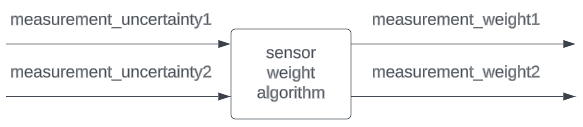

# Overview

The **Sensor Weight** estimates weights that change the magnitude of the **Mahalanobis Gate Distance** contained in the **Extended Kalman Filter Localizer** considering the uncertainty estimation from localization sensors

## Flowchart
The overall flowchart of the sensor_weight is described below

<p align="center">
  
</p>

## Features
This package includes the following features:

- **weight calculation ($W_M$)** for input uncertainty, using a linear relationship between the measured uncertainty ($\delta_{M}$) and a maximum allowed value ($\delta_{M_{\max}}$) as in the following equation: 

    $$W_M=\min(1, \max(0, 1 - (\delta_M / \delta_{M_{\max}})))$$
  
# Launch

The `sensor_weight` starts with the default parameters with the following command.

```
roslaunch sensor_weight sensor_weight.launch
```

The parameters and input topic names can be set in the `sensor_weight.launch` file.

# Parameter description

The parameters are set in `launch/sensor_weight.launch`

## For sensor measurement

|Name|Type|Description|Default value|
|:---|:---|:---|:---|
|max_uncertainty1|double|LiDAR uncertainty from NDT score [m]|500.0|
|max_uncertainty2|double|GNSS uncertainty from BESTPOS stdev [m]|2.00|